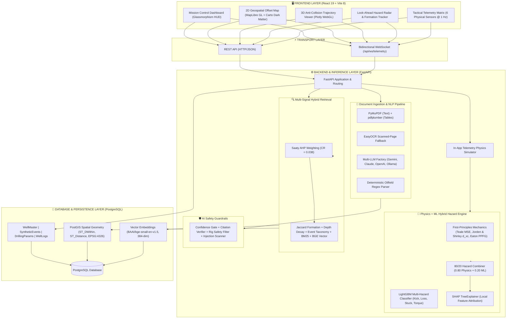

# PetrolQ — Nearby Wells Intelligence System

<div align="center">

[](https://www.python.org/)
[](https://nodejs.org/)
[](tests/)
[](LICENSE)
[](https://fastapi.tiangolo.com/)
[](https://react.dev/)

**An AI-Powered Offset Well Knowledge and Real-Time Decision Support Platform for Drilling Operations**

[Smart India Hackathon (SIH) 2026 Problem Statement](problem_statement.md) • [System Architecture Specification](docs/ARCHITECTURE.md) • [Changelog](CHANGELOG.md) • [Contributing Guide](CONTRIBUTING.md)

</div>

---

PetrolQ is an AI-powered Nearby Wells Intelligence and Decision Support Platform engineered for high-risk oil and gas drilling operations. Developed as an institutional memory alongside digital real-time monitoring systems (eRTMAC/SCADA), it extracts, structures, and correlates historical drilling knowledge from unstructured completion reports, daily drilling logs, and well curves. By synthesizing first-principles petroleum geomechanics with gradient-boosted machine learning, multi-signal hybrid retrieval, and deterministic safety guardrails, PetrolQ empowers drilling engineers to proactively predict downhole hazards—such as differential stuck pipe, gas kicks, and lost circulation—well before reaching critical depths.

---

## 1. System Architecture



---

## 2. Technology Stack

| Layer | Technologies & Libraries | Purpose |
| :--- | :--- | :--- |
| **Frontend** | React 19, Vite 8, Tailwind CSS, Lucide React, Axios | Reactive mission-control user interface and glassmorphism HUD |
| **Geospatial & 3D** | MapLibre GL, Carto Dark Matter raster/vector tiles, Plotly.js (WebGL) | 2D offset well radius visualization and 3D directional trajectory anti-collision |
| **Backend** | Python 3.10+, FastAPI, Uvicorn, Pydantic v2, WebSockets | Asynchronous REST endpoints and 1 Hz bidirectional telemetry streaming |
| **Database** | PostgreSQL 14+, PostGIS (`EPSG:4326`), `pgvector` / In-Memory Cosine Search, SQLAlchemy, GeoAlchemy2 | Spatial radius clustering, vector similarity search, and structured event storage |
| **ML & Physics** | LightGBM, SHAP, scikit-learn, NumPy, SciPy, FastDTW | Gradient-boosted multi-hazard classification, SHAP local feature attribution, and well log alignment |
| **Physics Engines** | First-principles implementations of Teale (1965), Jorden & Shirley (1966), Eaton (1975) | Mechanical Specific Energy (MSE), corrected $d$-exponent ($d_{xc}$), and pore pressure/fracture gradient |
| **NLP & Ingestion** | PyMuPDF (`fitz`), `pdfplumber`, EasyOCR, FastEmbed (`bge-small-en-v1.5`), LangChain Core | Multi-format PDF text/table parsing, scanned archive OCR, and structured Pydantic extraction |
| **AI Providers** | Google Gemini, Anthropic Claude, OpenAI, Ollama (Local) | Universal multi-provider LLM support with auto-detection and deterministic fallback |

---

## 3. Key Features

- 🗺️ **Interactive Geospatial Map & Radius Search**: Dynamic offset well visualization across 4 Indian basins within user-defined radii ($5\text{ km}$ to $50\text{ km}$) powered by PostGIS spherical distance functions (`ST_DWithin`).
- 📄 **Automated Document Extraction (NLP/OCR)**: Automated ingestion of Daily Drilling Reports (DDR) and Well Completion Reports (WCR) with table detection via `pdfplumber` and anti-fabrication `EasyOCR` fallback for scanned archives.
- 🔍 **Multi-Signal Hybrid Retrieval**: Subsurface event ranking combining Formation Jaccard similarity, Depth proximity linear decay, Event taxonomy matching, BM25 lexical overlap, and 384-dimensional dense semantic embeddings weighted using Saaty (1980) Analytic Hierarchy Process (AHP).
- ⚠️ **Hybrid Physics + ML Hazard Prediction**: 80/20 weighted predictive engine combining empirical petroleum physics (Teale MSE, Jorden & Shirley $d_{xc}$, Eaton PPFG) with LightGBM classification and local SHAP factor attribution.
- 🎯 **Look-Ahead Hazard Radar**: Proactive depth-projected offset well hazard visualizer identifying approaching stratigraphic formation tops, historical casing shoe depths, and offset NPT events.
- 🛡️ **AI Safety Guardrails Validation Layer**: Deterministic four-gate validator blocking confidence inflation, rejecting hallucinated citations, filtering prompt injections, and strictly forbidding autonomous physical rig control commands.
- ⏱️ **Time-Travel Backtest Validation**: Causal historical telemetry replay runner evaluating lead warning distance and time before real documented incidents (OIL-MORAN-1 stuck pipe, OIL-BAGHJAN-4 gas kick) with Wilson score confidence intervals.

---

## 4. Setup Instructions

### Prerequisites
- **Python**: Version 3.10 or higher
- **Node.js**: Version 18.x or higher with `npm`
- **Database**: PostgreSQL with `PostGIS` and `pgvector` extensions enabled *(optional for local testing; SQLite/mock fallback supported)*

### 4.1. Backend Setup

1. **Create and activate a virtual environment**:
   ```bash
   # Create virtual environment
   python -m venv venv

   # Activate on Windows (PowerShell):
   .\venv\Scripts\Activate.ps1

   # Activate on Linux / macOS:
   source venv/bin/activate
   ```

2. **Install pinned dependencies**:
   ```bash
   pip install -r requirements.txt
   ```

3. **Configure environment variables**:
   ```bash
   cp .env.example .env
   ```
   *Edit `.env` to configure your `DATABASE_URL` and choose your preferred AI provider (`LLM_PROVIDER=gemini`, `claude`, `openai`, `ollama`, or `auto`).*

4. **Initialize and seed the database**:
   ```bash
   python scripts/run_pipeline.py
   python scripts/seed_database.py
   ```

5. **Start the backend server**:
   ```bash
   uvicorn backend.main:app --host 127.0.0.1 --port 8000
   ```

### 4.2. Frontend Setup

1. **Navigate to the frontend directory and install dependencies**:
   ```bash
   cd frontend
   npm install
   ```

2. **Start the frontend development server**:
   ```bash
   npm run dev
   ```
   *The application will be live at `http://localhost:5173` with interactive Swagger API docs at `http://localhost:8000/docs`.*

### 4.3. Quick Start (Run Both Simultaneously)
You can launch both services together using the root orchestration scripts:
- **Cross-Platform**: Run `npm install` in the root, followed by `npm run dev`.
- **Windows**: Double-click `start.bat` or execute `.\start.bat`.

---

## 5. How to Run Tests

Ensure your virtual environment is active, then execute the automated test suite from the repository root:

```bash
# Run full backend test suite
python -m pytest tests/

# Run with verbose test-by-test breakdown
pytest tests/ -v
```

To verify frontend production bundle compilation:
```bash
cd frontend && npm run build
```

---

## 6. Data & Methodology

### Transparent Data Provenance Disclosure
PetrolQ was developed and calibrated using open petroleum industry datasets adapted to the geomechanical context of Indian sedimentary basins:

* **Primary Subsurface Baseline**: Well logs and directional trajectories are derived from **Equinor's Volve Open Dataset** (North Sea) and the **FORCE 2020 Machine Learning Competition** benchmark.
* **Geological Basin Adaptation**: Trajectories and lithologies are relabeled and calibrated to authentic Indian formations:
  * **Upper Assam Shelf**: 11 wells (`OIL-BAGHJAN-1`, `OIL-NAHARKATIYA-1`, `OIL-MORAN-1`, `OIL-DIKOM-1`, `OIL-TENGAKHAT-1`, etc.) calibrated to Dihing, Tipam, Surma, Barail, Kopili, and Disang stratigraphy.
  * **Rajasthan Basin**: 5 wells (`OIL-RAJ-BAGHEWALA-1` to `5`) calibrated to Pariwar sandstone and Bilara carbonate formations.
  * **Krishna-Godavari (KG) Deepwater**: 5 wells (`OIL-KG-DEEPWATER-1` to `5`) calibrated to Godavari clay/gumbo dynamics and narrow-margin subsea PP-FG windows.
  * **Mizoram Fold Belt**: 5 wells (`OIL-MZ-AIZAWL-1` to `5`) calibrated to Bokabil and Bhuban compressive thrust-fault regimes.
* **Disclosed Synthetic Calibration**: To enable rigorous evaluation across all operational scenarios, historical Daily Drilling Reports and high-frequency sensor streams are supplemented with disclosed synthetically calibrated geomechanical signatures. Every well and data view features an explicit per-item `SourceTag` provenance badge (`Volve`, `FORCE20`, `Synthetic`, or `Regionally Calibrated`) for total operational honesty.

### Theoretical Citations
All geomechanical models and predictive indicators in PetrolQ are directly grounded in published petroleum engineering literature:

1. **Pore Pressure & Fracture Gradient**:
   * **Eaton, B.A. (1975)**, *"The Equation for Geopressure Prediction from Well Logs"*, SPE-5544-MS.
   * **Eaton, B.A. (1969)**, *"Fracture Gradient Prediction and Its Application in Deep Drilling Operations"*, SPE-2163-PA, Journal of Petroleum Technology, 21(10), pp. 1353–1360.
2. **Mechanical Specific Energy (MSE)**:
   * **Teale, R. (1965)**, *"The Concept of Specific Energy in Rock Drilling"*, International Journal of Rock Mechanics and Mining Sciences & Geomechanics Abstracts, Vol. 2, No. 1, pp. 57–73.
   * **Dupriest, F.E. and Koederitz, W.L. (2005)**, *"Maximizing ROP With Real-Time M-E Analysis"*, SPE-92576.
3. **Corrected $d$-Exponent ($d_{xc}$)**:
   * **Jorden, J.R. and Shirley, O.J. (1966)**, *"Application of Drilling Performance Data to Overpressure Detection"*, SPE-1407, Journal of Petroleum Technology, 18(11), pp. 1387–1394.
   * **Rehm, W.A. and McClendon, R. (1971)**, *"Measurement of Formation Pressure in Field Conditions"*, SPE-3601.
4. **Multi-Criteria Weight Derivation**:
   * **Saaty, T.L. (1980)**, *"The Analytic Hierarchy Process"*, McGraw-Hill, New York.
5. **Statistical Uncertainty Calibration**:
   * **Wilson, E.B. (1927)**, *"Probable Inference, the Law of Succession, and Statistical Inference"*, Journal of the American Statistical Association, 22(158), pp. 209–212.

---

## 7. License

This project is licensed under the **MIT License**. See the [LICENSE](LICENSE) file for complete terms and copyright notices.