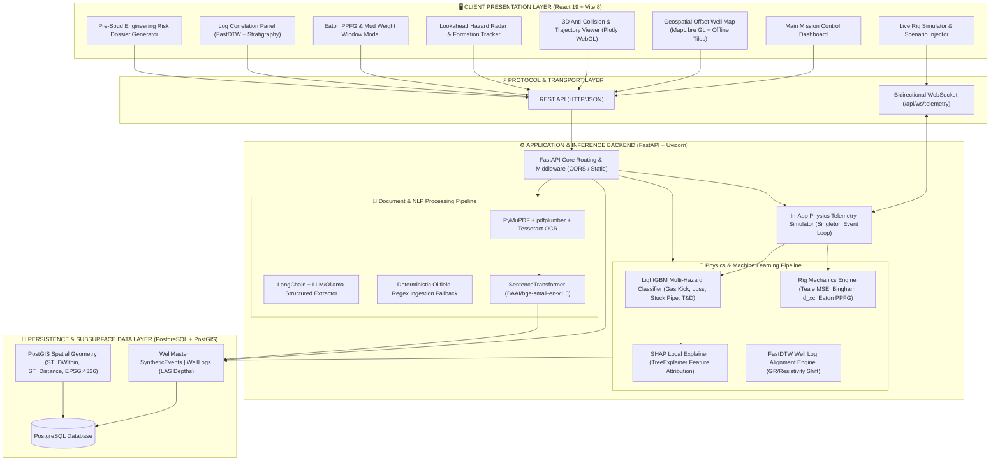

# PetrolQ — System Architecture Specification

> **Enterprise-Grade, Offline-First Nearby Wells Intelligence & Real-Time Decision Support System for Oil & Gas Drilling Operations**  
> *Developed for Smart India Hackathon (SIH) 2026*

---

## 1. Executive Summary & Architectural Philosophy

Drilling high-pressure, high-temperature (HPHT) and complex directional wells in structurally intricate fields (such as Upper Assam’s Baghjan, Moran, and Naharkatiya plays) carries extreme risks: wellbore collisions, sudden gas kicks, catastrophic lost circulation, and stuck pipe incidents resulting in millions of dollars in Non-Productive Time (NPT).

**PetrolQ** is engineered as an **offline-first, edge-ready, AI-augmented drilling intelligence platform**. The architecture synthesizes:
1. **Historical Subsurface Intelligence**: High-dimensional geospatial indexing (PostGIS) and Dynamic Time Warping (DTW) well log correlation across offset wells.
2. **Real-Time Physics & ML Hybrid Reasoning**: LightGBM multi-hazard classification coupled with Teale Mechanical Specific Energy (MSE), Bingham $d_{xc}$ exponent, and Eaton Pore Pressure/Fracture Gradient (PPFG) models.
3. **Transparent Explainability**: Local SHAP feature-attribution engine providing actionable engineering recommendations rather than "black-box" predictions.
4. **Resilient Unstructured Document Ingestion**: Dual-mode extraction combining LLM/Ollama semantic parsing with a deterministic regex domain fallback, coupled with vector similarity search.

---

## 2. High-Level System Architecture Diagram



---

## 3. Layer-by-Layer Architectural Breakdown

### 3.1. Client Presentation Layer (Frontend)
Built with **React 19** and bundled with **Vite 8**, styled using **Tailwind CSS**, designed to run locally or deployed via Netlify:
* **`WellMap.jsx`**: Geospatial visualization powered by `maplibre-gl`. In offline environments, it falls back to a locally hosted Slippy Tile raster server (`/tiles/{z}/{x}/{y}.png`); in online mode, it renders CartoDB vector basemaps. Wells are color-coded by real-time risk severity.
* **`Trajectory3DViewer.jsx`**: Interactive 3D trajectory visualization built on Plotly WebGL. Plots Minimum Curvature 3D paths for active wells and surrounding offset wells. Calculates 3D euclidean separation distance vectors and triggers 3D anti-collision proximity warnings.
* **`LookAheadRadar.jsx`**: Displays upcoming geological formations, historical fault zones, casing shoe depths, and potential NPT incidents projected within a customizable depth window ahead of the current bit depth.
* **`PPFGWindowModal.jsx`**: Renders real-time Eaton Pore Pressure Gradient, Mud Weight Equivalent Circulating Density (ECD), and Fracture Gradient curves. Highlights dynamic kick/loss kick tolerances.
* **`CorrelationPanel.jsx`**: FastDTW (Dynamic Time Warping) side-by-side well log correlation (Gamma Ray & Deep Induction Log). Highlights stratigraphic depth shifts and casing programs.
* **`PreSpudDossierModal.jsx`**: 1-Click executive engineering PDF-ready risk dossier aggregating offset well histories, NPT lessons learned, mud schedules, and clearance margins.

### 3.2. Communications & Streaming Layer
* **REST Endpoints (`/api/*`)**: Clean, OpenAPI/Swagger documented endpoints handling historical data queries, well trajectory lookups, PDF document parsing, and stratigraphic correlation.
* **Telemetry WebSocket (`/api/ws/telemetry`)**: Bidirectional streaming channel with a centralized `WebSocketConnectionManager`. Broadcasts 1 Hz synchronized rig sensor packets (Depth TVD, WOB, RPM, ROP, Torque, Mud Weight, ECD, Flow Out %, Pit Volume, SPP) and instant ML risk predictions to all connected browser tabs.

### 3.3. Intelligence, ML & Physics Engine
The core backend combines empirical petroleum formulas with gradient-boosted decision trees:
1. **LightGBM Multi-Hazard Classifier**:
   * Evaluates dynamic drilling inputs against rolling statistical windows ($ROP_{roll5}$, $Torque_{roll5\sigma}$).
   * Predicts risk probabilities across 4 distinct hazard categories: **Gas Kick**, **Lost Circulation**, **Stuck Pipe**, and **Torque & Drag**.
2. **Physics Diagnostic Metrics**:
   * **Mechanical Specific Energy (Teale, 1965)**:
     $$MSE = \frac{WOB}{A_b} + \frac{120 \cdot \pi \cdot N \cdot T}{A_b \cdot ROP}$$
     Detects bit wear, vibration dysfunction, and formation boundary transitions.
   * **Corrected $d$-Exponent (Bingham / Jordan & Shirley)**:
     $$d_{xc} = \frac{\log_{10}\left(\frac{ROP}{60 \cdot N}\right)}{\log_{10}\left(\frac{12 \cdot WOB}{10^6 \cdot D_b}\right)} \cdot \frac{\rho_{normal}}{\rho_{actual}}$$
     Provides early detection of abnormal pore pressure transitions before physical kick influx.
   * **Eaton Pore Pressure & Fracture Gradient (Eaton, 1975)**:
     Establishes operational drilling margins and maximum allowable mud weight.
3. **SHAP (SHapley Additive exPlanations)**:
   * Translates gradient boosting decisions into human-readable engineering insights (e.g., *"Torque rolling standard deviation (+450 ft-lbf) is the primary driver of stuck pipe risk"*).

### 3.4. Document Ingestion & Natural Language Processing (NLP)
* **Multi-Format Extraction**: Extracts raw text and tabular data from daily drilling reports (DDR), end-of-well reports (EOWR), and casing manifests using `PyMuPDF`, `pdfplumber`, and `pytesseract` (OCR).
* **Graceful Degradation Pipeline**:
  * *Primary Path*: LangChain structured output prompt with local LLM (Ollama / Llama-3).
  * *Defensive Fallback*: If Ollama is offline or experiences socket timeout (>150ms), the system seamlessly falls back to a deterministic regex domain parser scanning for oilfield vocabulary, depths, and NPT events.
* **Semantic Embeddings**: Generates 384-dimensional vector embeddings via `BAAI/bge-small-en-v1.5` using on-demand, lazy-loaded PyTorch CPU execution.

### 3.5. Persistence & Subsurface Storage
* **Relational Core**: PostgreSQL managed via SQLAlchemy ORM.
* **Spatial Indexing**: PostGIS geometry and geography types (`ST_MakePoint`, `ST_SetSRID`, `ST_DWithin`, `ST_Distance`) perform sub-millisecond offset well clustering and radial distance searches within any specified radius ($r \le 25\text{ km}$).
* **Relational Tables**:
  * `WellMaster`: Field, operator, surface latitude/longitude, total depth (TVD/MD), well status.
  * `SyntheticEvent`: Historical incidents, formation tops, root cause analyses, NPT hours, mitigation records, and 384-dim semantic embeddings.
  * `WellLog`: Digital LAS curves (Depth, GR, RES, NPHI, RHOB, DT).

---

## 4. End-to-End Data Flow Scenarios

### Scenario A: Real-Time Telemetry & Hazard Alerting
```
[ Rig Sensors / Simulator ]
         │ (Depth, WOB, RPM, ROP, Torque, Flow Out, Pit Gain, SPP)
         ▼
[ WebSocket Broadcast (/api/ws/telemetry) ]
         │
         ├──► [ Physics Engine: MSE, d_xc, PPFG Calculations ]
         │
         ├──► [ LightGBM Multi-Hazard Classifier ]
         │           │
         │           ▼
         ├──► [ SHAP Explainer: Top 3 Impact Factors ]
         │
         ▼
[ Broadcast to Client Dashboard (React / WebSocket) ]
         │
         ├──► Flash Red Alert Banner (if Risk >= 0.75)
         ├──► Update Live Gauge & Trajectory Position
         └──► Auto-Query RAG Engine for Offset Well Mitigations
```

### Scenario B: Offset Well RAG Search & Incident Mitigation
```
[ User Search / Automated Alert Trigger ]
         │ "Lost circulation in Barail Formation"
         ▼
[ SentenceTransformer: BAAI/bge-small-en-v1.5 ] ──► (384-dim vector)
         │
         ▼
[ PostgreSQL: In-Memory Cosine Similarity + PostGIS Spatial Filter ]
         │
         ▼
[ Ranked Historical Incidents with Proven Offset Well Mitigations ]
         │
         ▼
[ Rendered in Knowledge Search & Pre-Spud Dossier ]
```

---

## 5. Architectural Quality Attributes & Non-Functional Requirements

| Quality Attribute | Architectural Implementation |
|---|---|
| **100% Offline Resilience** | All ML models (`joblib`), embeddings (`bge-small`), GIS tiles, and database engines operate without internet access or third-party cloud APIs. |
| **Sub-Second Latency** | WebSocket telemetry loop executes at 1 Hz; ML inference + physics calculations take $< 45\text{ ms}$ per sample. |
| **Low Memory Footprint** | Lazy-loads PyTorch sentence transformer; lightweight LightGBM engine operates within constrained field hardware ($< 512\text{ MB}$ base memory). |
| **Fail-Safe Robustness** | Telemetry simulator and parser employ deterministic fallbacks; missing log curves or sensor dropouts produce clean null states instead of fatal crashes. |
| **Geospatial Precision** | WGS-84 coordinate reference system (EPSG:4326) with spherical distance calculations on the earth ellipsoid. |

---

## 6. Directory & Module Mapping

```
sih_2026/
├── backend/
│   ├── main.py                  # ASGI FastAPI application entrypoint & REST/WS routes
│   ├── database.py              # SQLAlchemy engine & PostgreSQL connection pool
│   ├── models.py                # Database schemas (WellMaster, SyntheticEvent, WellLog)
│   ├── schemas.py               # Pydantic request/response validation schemas
│   ├── simulator.py             # Singleton in-app drilling physics simulator & WS manager
│   ├── trajectory_calc.py       # Minimum Curvature 3D wellbore trajectory & anti-collision
│   ├── api/
│   │   ├── upload.py            # LAS and PDF report ingestion endpoints
│   │   ├── correlate.py         # FastDTW stratigraphic well log correlation
│   │   ├── lookahead.py         # Subsurface lookahead formation & hazard radar
│   │   ├── ppfg.py              # Eaton pore pressure & fracture gradient computation
│   │   └── dossier.py           # 1-Click Pre-Spud Risk Dossier compilation
│   ├── ml/
│   │   ├── service.py           # HazardPredictionService (LightGBM + SHAP + Physics)
│   │   └── artifacts/           # Trained LightGBM model, SHAP explainer, metadata
│   └── nlp/
│       ├── config.py            # Lazy-loaded BGE embedding model & LLM settings
│       ├── parser.py            # PDF text and tabular extraction engine
│       ├── extractor.py         # Structured incident extraction with regex fallback
│       └── ingest.py            # Automated report ingestion pipeline
├── frontend/
│   ├── src/
│   │   ├── App.jsx              # Central Mission Control layout & state orchestration
│   │   ├── lib/api.js           # Centralized API_BASE & WS_BASE environment config
│   │   └── components/
│   │       ├── WellMap.jsx               # MapLibre GL 2D spatial offset well visualizer
│   │       ├── Trajectory3DViewer.jsx    # Plotly 3D directional wellbore clearance viewer
│   │       ├── LookAheadRadar.jsx        # Ahead-of-the-bit hazard & formation projection
│   │       ├── PPFGWindowModal.jsx       # Eaton Pore Pressure & Mud Weight Window plot
│   │       ├── CorrelationPanel.jsx      # Stratigraphic log correlation & casing alignment
│   │       ├── PreSpudDossierModal.jsx   # Pre-Spud Engineering Risk Dossier generator
│   │       └── DocumentUploadModal.jsx   # DDR / LAS file ingestion modal
│   └── vite.config.js           # Vite build and development configuration
├── netlify.toml                 # Frontend deployment configuration
├── render.yaml                  # Backend deployment configuration
├── Procfile                     # Container process startup specification
└── package.json                 # Unified multi-service runner scripts
```
