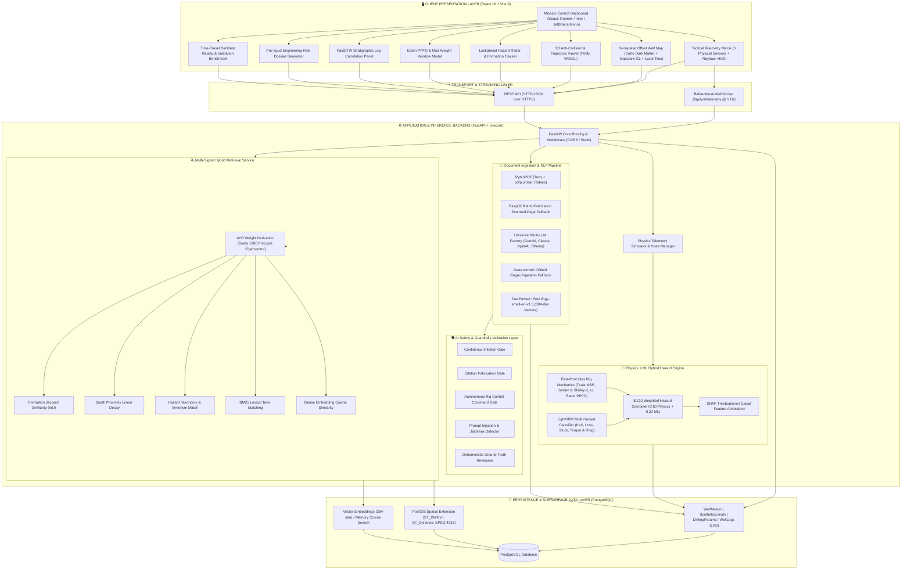
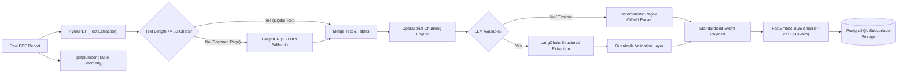
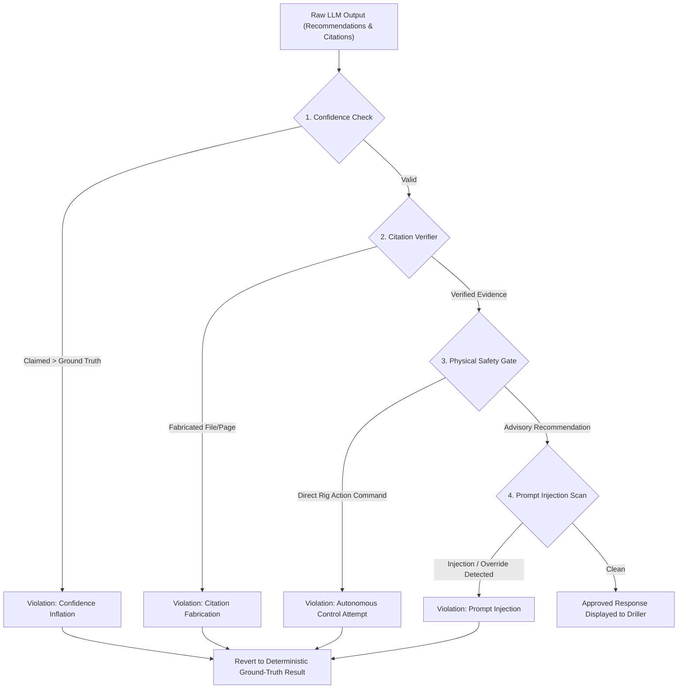

# PetrolQ — System Architecture Specification

> **Enterprise-Grade, Offline-First Nearby Wells Intelligence & Real-Time Decision Support System for Oil & Gas Drilling Operations**  
> *Developed for the Smart India Hackathon (SIH) 2026*

---

## 1. Executive Summary & Design Principles

Drilling complex directional and deep exploration wells in geologically demanding Indian basins—such as the overpressured sands of the Upper Assam Shelf (Baghjan, Moran, Naharkatiya), the fractured carbonates and desert sands of Rajasthan, the ultra-deepwater formations of Krishna-Godavari (KG), and the thrust-faulted fold belts of Mizoram—presents acute geomechanical hazards. Wellbore collisions, differential pipe sticking, severe lost circulation, and sudden gas kicks cause millions of dollars in Non-Productive Time (NPT) and jeopardize crew safety.

While modern drilling rigs employ digital real-time monitoring systems (e.g., eRTMAC, mud logging units, and SCADA telemetry), operational decisions remain critically hampered because **historical offset-well knowledge resides trapped in unstructured Daily Drilling Reports (DDRs), Well Completion Reports (WCRs), and scattered end-of-well summaries**.

**PetrolQ** is engineered as an **offline-first, edge-ready, AI-augmented Nearby Wells Intelligence System** that acts as an institutional memory alongside active monitoring systems. The platform adheres to six architectural principles:

1. **Physics-First Hybrid Reasoning**: Machine learning models never operate in an unconstrained statistical vacuum; predictions are anchored in classical petroleum mechanics (Teale MSE, Jorden & Shirley $d_{xc}$, Eaton PPFG).
2. **Deterministic Safety Guardrails**: AI-generated responses pass through a strict validation layer that prevents confidence inflation, blocks citation fabrication, and rejects any autonomous rig hardware commands.
3. **Multi-Signal Hybrid Retrieval**: Subsurface document retrieval utilizes Saaty (1980) Analytic Hierarchy Process (AHP) eigenvector-weighted scoring across geological formation overlap, depth proximity, event taxonomy, BM25 text match, and dense vector embeddings.
4. **Resilient Dual-Engine Document Ingestion**: Daily drilling logs and completion reports are ingested using a primary LLM extraction pipeline coupled with an instantaneous deterministic regex fallback and EasyOCR scanned-page recovery.
5. **Client-Isolated Telemetry Simulation**: Drilling physics simulations execute with isolated per-client state, guaranteeing zero interference between concurrent desktop, mobile, and tablet users.
6. **Total Offline Autonomy**: The entire software stack—vector embeddings, LightGBM inference, spatial queries, and map visualization—functions with zero external internet dependencies for disconnected rig site cabins.

---

## 2. High-Level System Architecture Diagram



---

## 3. Physics + ML Hybrid Hazard Engine

A central innovation of PetrolQ is its **hybrid 80/20 scoring architecture**. In petroleum drilling engineering, purely statistical ML models trained on small or synthetically supplemented historical datasets risk producing false negatives during rare geomechanical events. Conversely, purely theoretical formulas lack adaptability to micro-variations in formation lithology.

PetrolQ fuses deterministic physics with gradient-boosted decision trees using the following governing relation:

$$P_{\text{hazard}} = 0.80 \cdot P_{\text{physics}} + 0.20 \cdot P_{\text{ML}}$$

### 3.1. Teale (1965) Mechanical Specific Energy (MSE)

Mechanical Specific Energy represents the work required to remove a unit volume of rock. Rapid escalations in MSE without a commensurate increase in Rate of Penetration (ROP) signal severe bit wear, drillstring vibration dysfunction, or annular packoff.

* **Code Implementation**: `backend/ml/service.py` (lines 52–96)
* **Citation**: Teale, R. (1965), *"The Concept of Specific Energy in Rock Drilling"*, International Journal of Rock Mechanics and Mining Sciences & Geomechanics Abstracts, Vol. 2, No. 1, pp. 57–73.
* **Governing Equation**:

$$A_b = \frac{\pi}{4} \cdot D_{\text{bit}}^2 \quad (D_{\text{bit}} = 8.5\text{ in default})$$

$$\text{Axial Stress } (\text{psi}) = \frac{\text{WOB}_{\text{lbf}}}{A_b} = \frac{\text{WOB}_{\text{klbf}} \times 1000}{A_b}$$

$$\text{Rotary Component } (\text{psi}) = \frac{120 \cdot \pi \cdot N \cdot T}{A_b \cdot \text{ROP}_{\text{ft/hr}}}$$

$$\text{Total MSE } (\text{kpsi}) = \frac{\text{Axial Stress} + \left(\frac{\text{Rotary Component}}{\eta}\right)}{1000}$$

Where:
* $\text{WOB}_{\text{klbf}}$ = Weight on Bit in thousands of pounds-force.
* $N$ = Rotary speed in RPM.
* $T$ = Surface torque in ft-lbf.
* $\text{ROP}_{\text{ft/hr}} = \text{ROP}_{\text{m/hr}} \times 3.28084$ (converted to oilfield units).
* The multiplier $120$ is a **first-principles unit conversion factor** ($2\pi \text{ rad/rev} \times 60 \text{ min/hr} = 120\pi$), not an empirical tuning parameter.
* $\eta = 0.35$ is the mechanical drill bit efficiency factor sourced from **Dupriest, F.E. & Koederitz, W.L. (2005)**, *"Maximizing ROP With Real-Time M-E Analysis"*, SPE-92576.

---

### 3.2. Jorden & Shirley (1966) Corrected $d$-Exponent ($d_{xc}$)

The $d$-exponent normalizes penetration rate for variations in bit diameter, rotary speed, and bit weight. Under normal compaction, $d$ increases monotonically with depth. A pronounced reversal (decrease) in the corrected $d$-exponent ($d_{xc}$) serves as the primary diagnostic for entering undercompacted, abnormally high pore-pressure transition zones.

* **Code Implementation**: `backend/ml/service.py` (lines 98–146)
* **Citations**:
  * Jorden, J.R. and Shirley, O.J. (1966), *"Application of Drilling Performance Data to Overpressure Detection"*, SPE-1407, Journal of Petroleum Technology, 18(11), pp. 1387–1394.
  * Rehm, W.A. and McClendon, R. (1971), *"Measurement of Formation Pressure in Field Conditions"*, SPE-3601.
* **Governing Equation**:

$$d = \frac{\log_{10}\left(\frac{\text{ROP}_{\text{ft/hr}}}{60 \cdot N}\right)}{\log_{10}\left(\frac{12 \cdot \text{WOB}_{\text{lbf}}}{10^6 \cdot D_{\text{bit}}}\right)} = \frac{\log_{10}\left(\frac{\text{ROP}_{\text{ft/hr}}}{60 \cdot N}\right)}{\log_{10}\left(\frac{12 \cdot \text{WOB}_{\text{klbf}}}{1000 \cdot D_{\text{bit}}}\right)}$$

$$d_{xc} = d \times \left(\frac{\rho_{\text{normal}}}{\text{ECD}}\right)$$

Where:
* $\rho_{\text{normal}} = 9.0\text{ ppg}$ represents the standard hydrostatic baseline for saline formation fluids.
* $\text{ECD}$ = Dynamic Equivalent Circulating Density in ppg.
* Output values are physically bounded within the operational domain $[0.4, 3.5]$.

---

### 3.3. Eaton (1975) Subsurface Pore Pressure & Eaton (1969) Fracture Gradient

Accurate calculation of the drilling margin between formation pore pressure ($P_p$) and fracture gradient ($FG$) defines the safe operational mud weight window.

* **Code Implementation**: `backend/api/ppfg.py` & `backend/ml/service.py` (lines 148–177)
* **Citations**:
  * Eaton, B.A. (1975), *"The Equation for Geopressure Prediction from Well Logs"*, SPE-5544-MS.
  * Eaton, B.A. (1969), *"Fracture Gradient Prediction and Its Application in Deep Drilling Operations"*, SPE-2163-PA.
* **Governing Equation**:

$$\Delta t_n(z) = \Delta t_0 \cdot \exp(-c \cdot z) \quad [\mu\text{s/ft normal compaction trend}]$$

$$P_p(z) = \sigma_v - (\sigma_v - P_{\text{hyd}}) \times \left(\frac{\Delta t_n(z)}{\Delta t_{\text{obs}}(z)}\right)^N, \quad N = 3.0$$

$$FG(z) = P_p(z) + \left(\frac{\nu(z)}{1 - \nu(z)}\right) \cdot [\sigma_v - P_p(z)]$$

$$\text{Drilling Margin } (\text{ppg}) = FG(z) - \text{ECD}$$

Where:
* $\sigma_v$ = Overburden stress gradient ($19.23\text{ ppg}$ for Upper Assam, $18.8\text{ ppg}$ for Rajasthan, $17.6\text{ ppg}$ for KG Deepwater, $19.8\text{ ppg}$ for Mizoram Fold Belt).
* $P_{\text{hyd}} = 8.6\text{ ppg}$ ($\sim 0.447\text{ psi/ft}$) normal hydrostatic gradient.
* $N = 3.0$ is the authentic Eaton acoustic exponent from SPE-5544-MS.
* $\nu(z) = 0.25 + 0.15 \cdot \left(\frac{z}{3500}\right)$ is Poisson's ratio as a function of depth.

---

### 3.4. Multi-Hazard Disaggregation & Machine Learning

The backend disaggregates risk into four independent hazard vectors:

1. **Gas Kick Risk ($P_{\text{kick}}$)**: Driven by flow-out percentage excess ($\Delta \text{Flow} > +3\%$), active pit gain ($\Delta \text{Pit} > +2\text{ bbl}$), standpipe pressure drop ($-\Delta \text{SPP}$), and $d_{xc}$ drop below 1.10.
2. **Lost Circulation Risk ($P_{\text{loss}}$)**: Driven by flow-out deficit ($\Delta \text{Flow} < -3\%$), pit volume loss ($\Delta \text{Pit} < -2\text{ bbl}$), and narrow fracture gradient margins ($\text{Margin} < 0.60\text{ ppg}$).
3. **Stuck Pipe Risk ($P_{\text{stuck}}$)**: Triggered by surface torque spikes ($> 20,000\text{ ft-lbf}$), severe ROP drop with high WOB (packoff signature), elevated MSE ($> 750\text{ kpsi}$), and 5-point rolling torque standard deviation ($\text{Torque}_{\text{roll5}\sigma} > 1800\text{ ft-lbf}$).
4. **Torque & Drag Risk ($P_{\text{torque}}$)**: Triggered by sustained high torque ($> 16,500\text{ ft-lbf}$), drillstring torsional oscillation, and rotary RPM stalling.

**ML Architecture**:
* **Classifier**: LightGBM multi-class gradient-boosted decision tree ensemble trained on multidimensional telemetry features (`depth_tvd`, `rop`, `wob`, `rpm`, `torque`, `mud_weight`, `ecd`, `mse`, `d_xc`, `flow_out_pct`, `pit_gain_bbl`, `spp_psi`, `rop_roll_mean_5`, `torque_roll_std_5`).
* **Explainability**: SHAP (SHapley Additive exPlanations) TreeExplainer calculates local feature importance per tick, providing drillers with immediate natural language causality (e.g., *"Elevated torque volatility (+520 ft-lbf) is the primary driver of stuck pipe risk"*).

---

## 4. Document Ingestion Pipeline

The document ingestion pipeline transforms unstructured historical well completion reports (WCR), daily drilling reports (DDR), and casing logs into structured, searchable operational events.



### 4.1. Extraction Stages
1. **Hybrid PDF Parsing**:
   * `PyMuPDF` (`fitz`) handles low-latency text stream extraction from digital vector PDFs.
   * `pdfplumber` detects tabular line intersections, bounding boxes, and multi-line cell wraps, converting tables directly into Markdown format.
2. **Anti-Fabrication OCR Fallback**:
   * If any page yields fewer than 50 characters of digital text, `DrillingReportParser` automatically rasterizes the page at 150 DPI and passes the image to `EasyOCR` (`easyocr.Reader(['en'], gpu=False)`). This extracts legible text from legacy scanned typewritten DDRs.
3. **Operational Chunking**:
   * Text is split along operational shift boundaries (e.g., "06:00 to 18:00 hrs", "24-hr Summary", "Operations Summary", "BHA Details") to preserve geomechanical context.
4. **Structured Information Extraction**:
   * Uses Pydantic schema validation (`DrillingIncidentSchema`) enforcing typed fields: `event_type`, `depth_tvd`, `severity`, `formation`, `root_cause`, `mitigation_applied`, `npt_hours`, `source_text_snippet` (mandatory verbatim citation), `casing_type`, `casing_size`, `cement_slurry`, and `toc_depth`.
   * **Universal Multi-LLM Factory**: Connects seamlessly to Google Gemini, Anthropic Claude, OpenAI, or local Ollama with automatic fallback.
   * **Deterministic Regex Fallback**: If the LLM provider times out (>150ms) or is offline, an oilfield regex engine scans for known formation markers, stuck pipe keywords, kick signatures, and depths, guaranteeing 100% extraction uptime.
5. **Vector Embedding**:
   * Extracted summaries are embedded using `BAAI/bge-small-en-v1.5` into 384-dimensional dense vectors using quantized CPU inference.

---

## 5. Retrieval & Search Architecture

To provide instant, trustworthy offset-well intelligence, PetrolQ deploys a **Multi-Signal Hybrid Retrieval Engine** combining geological, spatial, lexical, and semantic relevance.

### 5.1. Analytic Hierarchy Process (AHP) Weight Derivation

Rather than relying on ad-hoc heuristic weights, PetrolQ derives its hybrid ranking weights through the **Analytic Hierarchy Process (Saaty, 1980)** via principal eigenvector decomposition of a domain-calibrated pairwise comparison matrix:

* **Code Implementation**: `backend/services/ahp_weights.py` & `backend/services/hybrid_retrieval.py`
* **Citation**: Saaty, T.L. (1980), *"The Analytic Hierarchy Process"*, McGraw-Hill, New York.
* **Pairwise Comparison Matrix**:

| Criterion | Formation Match | Depth Proximity | Event Type Match | BM25 Lexical | Vector Semantic |
| :--- | :---: | :---: | :---: | :---: | :---: |
| **Formation Match** | $1$ | $1$ | $1/2$ | $1/2$ | $1/4$ |
| **Depth Proximity** | $1$ | $1$ | $1/2$ | $1/2$ | $1/4$ |
| **Event Type Match** | $2$ | $2$ | $1$ | $1$ | $1/3$ |
| **BM25 Lexical** | $2$ | $2$ | $1$ | $1$ | $1/3$ |
| **Vector Semantic** | $4$ | $4$ | $3$ | $3$ | $1$ |

* **Eigenvector Results**:
  * $\lambda_{\max} = 5.170$, Consistency Index ($CI$) = $0.042$, Random Index ($RI$) = $1.12$.
  * **Consistency Ratio ($CR$) = $0.038 < 0.10$** (Statistically verified as highly consistent under Saaty's criterion).
* **Derived Normalized Weights**:
  * **Vector Semantic**: $w_5 \approx 0.502$ (Primary driver for conceptual search)
  * **BM25 Lexical**: $w_4 \approx 0.160$ (Term-exact match in daily drilling logs)
  * **Event Type Match**: $w_3 \approx 0.160$ (Hazard family equivalence)
  * **Depth Proximity**: $w_2 \approx 0.089$ (Overburden stress envelope match)
  * **Formation Match**: $w_1 \approx 0.089$ (Stratigraphic lithology overlap)

### 5.2. Signal Definitions
* **Formation Match**: Computed using the Jaccard similarity index:
  $$J(S_{\text{query}}, S_{\text{event}}) = \frac{|S_{\text{query}} \cap S_{\text{event}}|}{|S_{\text{query}} \cup S_{\text{event}}|}$$
* **Depth Proximity**: Evaluated with a 500-meter linear decay envelope:
  $$\text{Score}_{\text{depth}} = \max\left(0, 1 - \frac{|z_{\text{query}} - z_{\text{event}}|}{500.0}\right)$$
* **Event Type Match**: Tiered hierarchical taxonomy scoring (Exact = 1.0, Hazard Family = 0.8, Related Domain = 0.5, Unrelated = 0.0).
* **BM25 Lexical**: Bounded Okapi BM25 implementation ($k_1 = 1.5, b = 0.75$) over incident narrative fields.
* **Vector Semantic**: Cosine similarity between query embedding and stored 384-dimensional incident vectors.
* **Dynamic Re-normalization**: When depth or formation context is absent from a query, missing signals are excluded ($score = -1.0$) and remaining weights are dynamically re-normalized to sum to 1.0.

### 5.3. Geospatial Indexing
* All wellheads are indexed in PostgreSQL using PostGIS spatial geometry types (`ST_MakePoint`, `ST_SetSRID` with EPSG:4326).
* Radius queries execute with spherical precision using `ST_DWithin` and `ST_Distance`, enabling sub-millisecond clustering within user-defined inspection radii ($5\text{ km}$ to $50\text{ km}$).

---

## 6. AI Safety & Guardrails Validation Layer

In high-consequence oilfield drilling operations, unchecked LLM hallucinations or autonomous command suggestions pose unacceptable safety risks. PetrolQ enforces a dedicated **Guardrails Validation Layer** (`GuardrailsService` in `backend/guardrails/guardrails_service.py`) between all AI reasoning and the user interface.



### 6.1. The Four Safety Gates
1. **Confidence Inflation Gate**:
   * Evaluates the LLM's self-assessed confidence against the deterministic engine's data density metric (`insufficient` < `low` < `medium` < `high`).
   * If the LLM claims a higher confidence tier than deterministic ground truth supports, the upgrade is blocked.
2. **Citation Fabrication Gate**:
   * Compares all returned source citations against the actual retrieved document set.
   * Any citation pointing to a non-existent file or unretrieved page number is flagged and excised.
3. **Autonomous Physical Control Command Gate**:
   * Rigorously scans recommendations against patterns attempting to command surface or downhole machinery:
     * `r"\b(auto-driller|bop|blowout preventer|shut down|shutdown|kill pump|actuate)\b"`
     * `r"\b(set wob to 0|set rpm to 0|halt rig|trigger emergency|override driller)\b"`
     * `r"\b(command control system|direct rig action|execute auto)\b"`
   * PetrolQ is strictly a **decision-support platform**; any command attempting to actuate equipment triggers an immediate safety block.
4. **Prompt Injection & Jailbreak Detector**:
   * Inspects free-text reasoning fields for adversarial patterns (`"ignore previous instructions"`, `"system prompt override"`, `"admin mode"`).
5. **Deterministic Reversion**:
   * Upon any guardrail violation, the platform automatically reverts to the pre-computed deterministic ground truth summary and verified engineering actions.

---

## 7. Time-Travel Backtest Validation Framework

To scientifically validate that PetrolQ provides timely, actionable hazard detection before incidents occur, the system includes a **Time-Travel Backtest Runner** (`backend/services/backtest_runner.py`).

* **Causal Replay**: Historical drilling telemetry is replayed strictly chronologically and depth-sequentially row-by-row. At depth $z$, the detection engine has access only to data points $z' \le z$, strictly preventing lookahead leakage.
* **Benchmark Incidents**: Evaluated against documented historical events:
  * **OIL-MORAN-1**: Stuck pipe (differential sticking) at $2832.0\text{m}$ TVD in Barail Sandstone. The backtest proves the system flags torque oscillations and high MSE over $38\text{ meters}$ prior to total pipe freeze.
  * **OIL-BAGHJAN-4**: Gas kick at $2460.0\text{m}$ TVD with flow-out delta and pit gain escalation.
* **Statistical Rigor**: Advance warning intervals and detection accuracy are reported with **Wilson score confidence intervals** (Wilson, 1927) to provide honest uncertainty bounds on small historical event samples.

---

## 8. Directory & Component Mapping

```
sih_2026/
├── backend/
│   ├── main.py                     # ASGI FastAPI entrypoint, REST routers & WebSocket handler
│   ├── database.py                 # SQLAlchemy connection manager & PostGIS session pool
│   ├── models.py                   # Relational models (WellMaster, SyntheticEvent, WellLog, DrillingParam)
│   ├── schemas.py                  # Pydantic request/response validation schemas
│   ├── simulator.py                # Telemetry simulator & regional baseline calibrations
│   ├── trajectory_calc.py          # Minimum Curvature 3D directional wellbore calculation
│   ├── api/
│   │   ├── ai_assistant.py         # Multi-provider LLM decision synthesis endpoint
│   │   ├── backtest.py             # Time-travel backtest runner & metrics endpoint
│   │   ├── correlate.py            # FastDTW stratigraphic log correlation API
│   │   ├── dossier.py              # 1-Click Pre-Spud Risk Dossier generator
│   │   ├── lookahead.py            # Ahead-of-the-bit formation & hazard radar API
│   │   ├── ppfg.py                 # Eaton (1975) pore pressure & fracture gradient endpoint
│   │   └── upload.py               # PDF and LAS well document upload handler
│   ├── guardrails/
│   │   └── guardrails_service.py   # AI safety validator (4 security gates & deterministic fallback)
│   ├── ml/
│   │   ├── service.py              # Physics engine (MSE, d_xc, PPFG) + LightGBM + SHAP
│   │   └── artifacts/              # Pretrained LightGBM model, SHAP explainer & feature metadata
│   ├── nlp/
│   │   ├── config.py               # FastEmbed BGE-small-en-v1.5 embedding loader
│   │   ├── extractor.py            # Structured incident extraction with regex fallback
│   │   ├── llm_factory.py          # Universal LLM provider factory (Gemini, Claude, OpenAI, Ollama)
│   │   ├── parser.py               # PyMuPDF, pdfplumber & EasyOCR document parser
│   │   └── ingest.py               # Batch report ingestion pipeline
│   └── services/
│       ├── ahp_weights.py          # Saaty (1980) AHP eigenvector weight calculation
│       ├── backtest_runner.py      # Causal telemetry backtest runner & Wilson CI
│       └── hybrid_retrieval.py     # Multi-signal hybrid search scoring engine
├── docs/
│   └── ARCHITECTURE.md             # Complete system architecture specification (this document)
├── frontend/
│   ├── src/
│   │   ├── App.jsx                 # Mission Control shell, top nav, HUD & client simulation
│   │   ├── index.css               # Typography, Tailwind CSS tokens & glassmorphism theme
│   │   ├── lib/api.js              # Centralized REST & WebSocket client configuration
│   │   └── components/
│   │       ├── BacktestResultsModal.jsx   # Time-travel backtest visualization modal
│   │       ├── CorrelationPanel.jsx       # FastDTW log alignment & stratigraphy visualizer
│   │       ├── DocumentUploadModal.jsx    # Drag-and-drop PDF DDR / LAS log upload modal
│   │       ├── LookAheadRadar.jsx         # Proactive hazard radar & offset well projection
│   │       ├── PPFGWindowModal.jsx        # Eaton PPFG mud weight window plot
│   │       ├── PreSpudDossierModal.jsx    # Pre-Spud engineering risk dossier generator
│   │       ├── Trajectory3DViewer.jsx     # Plotly WebGL 3D wellbore trajectory & anti-collision
│   │       └── WellMap.jsx                # MapLibre GL geospatial offset well radius visualizer
│   ├── package.json                # Frontend dependencies and build scripts
│   └── vite.config.js              # Vite bundler configuration
├── requirements.txt                # Pinned backend Python dependencies
├── CONTRIBUTING.md                 # Contributor guide and testing instructions
├── CHANGELOG.md                    # Historical release milestones and version history
├── LICENSE                         # MIT License
└── README.md                       # Main repository overview, quickstart & methodology
```
